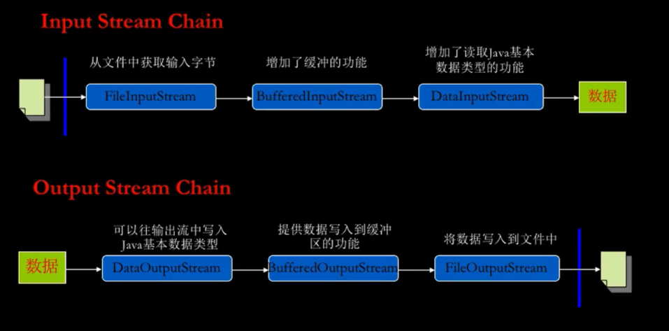
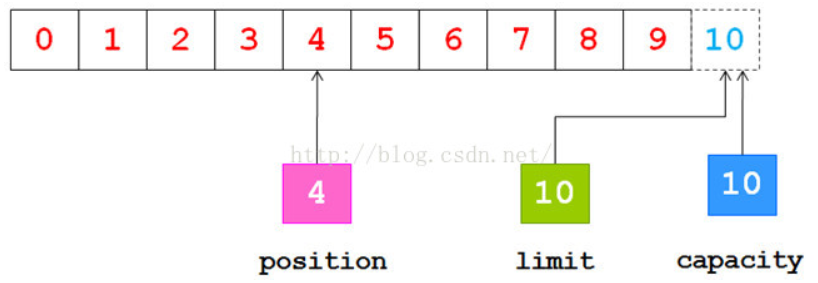
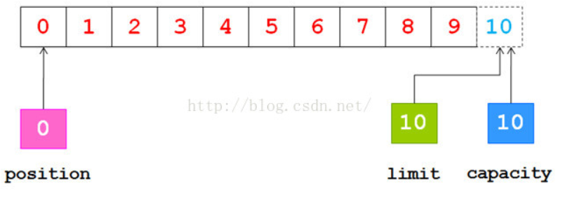

[toc]

### netty概述

- [netty](netty.io)是一个**异步的基于事件驱动的网络应用框架**，用于快速开发可维护的高性能协议服务端和客户端。

#### 设计

- 针对各种传输类型设计了一个统一的API，无论是阻塞的还是非阻塞的socket。

- 基于一种灵活的并且可扩展的事件模型，可进行关注点分离

- 提供了高度可定制化的线程模型，单线程、一个或多个线程池等，比如`SEDA`

  > SEDA：Staged Event Driven Architecture，把一个请求处理过程分成若干Stage，不同的Stage使用不同数量的线程来处理

- 可以真正实现无连接的数据报支持

  

### BIO

- 

#### 装饰者模式

- 装饰者模式是继承关系的一个替代方案，**可以在不创建更多子类，不必改变原类文件的情况下，通过创建一个包装对象，动态扩展对象功能**
- 装饰者模式用来扩展特性对象的功能，不需要子类，是动态扩展，运行时分配职责，可以防止由于子类而导致的复杂和混乱，有更多的灵活性，对于一个给定的对象，同时可能有不同的装饰对象，客户端可以通过它的需要选择合适的装饰对象发消息
- 继承用来扩展一类对象的功能，需要子类，是静态的，编译时分配职责，导致很多子类产生，确认灵活性

### NIO

- BIO中最为核心的概念是流(Stream)，面向流编程，一个流要么是输入流，要么是输出流
- NIO核心：通道、缓冲区、选择器。NIO中是面向块(block)或是缓冲区(buffer)编程的
- Buffer本身就是一块内存，实际是个数组，数据的读写都是通过buffer来实现
- Channel值得是可以向其写入数据或者从中读取数据的对象
- Channel是双向的，一个流只可能是输入流或者输出流，但Channel打开后可以读、写

### java.io.Buffer

> 一个具体的原生类型的数据容器
>
> Buffer是一个线性的，特定原生类型元素的有限序列，除了它的内容之外，一个buffer重要的属性就是`capacity`，`limit`，`position`
>
> 一个buffer的`capacity`就是它所包含的元素数量，一个buffer的`capacity`不会为负数并且不会变化
>
> 一个buffer的`limit`指第一个不应该被读或写的元素索引，一个buffer的`limit`不会为负数并且不会大于`capacity`
>
> 一个buffer的`position`指下一个将被读或写的元素索引。一个buffer的`position`不会为负数并且不会大于`limit`

- 比如创建一个大小为10的ByteBuffer对象，初始时position=0，limit和capacity为10

  

- 调用`put()`方法从通道中读4个字节数据到缓冲区后，position指向4，即下一个操作的字节索引为4

  

- 再从缓冲区把数据输出到通道，在此之前**必须调用`flip()`方法**，它将limit设为position当前位置，将position设为0

  

- 调用`get()`方法把数据从缓冲区输出到通道，position增加，limit不变，但position不会超过limit。把4字节数据都输出后

  

- 调用`clear()`方法，指针又变为原状态

  

> 对于每个非布尔类型的原生类型，这个类都有一个子类
>
> 每个子类都定义了两类`get`和`put`操作
>
> 相对操作：从当前position开始根据传入的元素个数增加position位置，读或写一个或多个元素。如果所要求的转换超过了limit大小，那么相对的get操作会抛出`BufferUnderflowException`异常，相对的put操作会抛出`BufferOverflowException`异常，无论哪种情况，都没有数据传输
>
> 绝对操作：接收一个显示的元素索引，不会影响position，如果操作的元素索引超出了limit大小，那么get或put操作会抛出`IndexOutOfBoundsException`异常
>
> 数据还可以通过恰当的IO通道这种操作来输入或者从buffer输出，它总是相对于当前的position。
>
> 一个buffer的mark表示当`reset()`方法被调用时它的position会被重置到那个索引位置。如果mark定义了，当position或者limit调节到比mark小的值时，mark会被丢弃。如果mark没有定义，但调用了`reset()`方法，就会抛出`InvalidMarkException`异常。

- **`0 <= mark <= position <= limit <= capacity`**

> 一个新创建的buffer，它的position值总是为0，mark值是未定义的。limit值可能是0，也可能是其他值，取决于buffer构建的方式，新分配的buffer它的每个值都是0
>
> 除了访问position，limit，capacity值及重置mark值之外，这个类还定义了如下操作
>
> `clear()`让一个buffer准备好一个新的通道的读或者相对的`put()`操作，它会将limit设为capacity的值，将position设为0。
>
> `flip()`让一个buffer准备好一个新的通道的写或者相对的`get()`操作，它会将limit设为position的值，将position设为0。
>
> `rewind()`让一个buffer准备好重新读它已经包含的数据，它会将limit保持不变，将position设置为0。
>
> 每个buffer都是可读的，但不是每个buffer都是可写的，每个buffer的可变方法都被指定为可选操作。如果在只读buffer上调用写方法会抛出`ReadOnlyBufferException`异常。只读buffer不允许内容发生改变，但它的mark、position、limit值是可以变化的，无论一个buffer只读与否，都可以通过`isReadOnly()`方法来判断。
>
> buffer不是线程安全的，如果buffer在多线程中使用，需要进行同步操作
>
> 这个类中的方法，如果没有指定返回值，那么会返回这个buffer本身。这就允许方法可以链接起来，比如：`b.flip();b.position(23);b.limit(42)`可以被`b.flip().position(23).limit(42)`替代。

