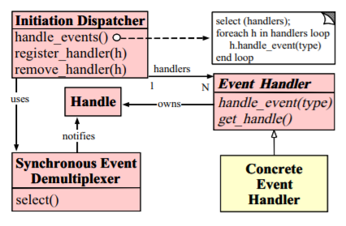

## 传统方式 VS Reactor

### 传统模式

- 通过`ServerSocket`调用`accept`方法进行阻塞，等待客户端连接

- 客户端连接后，一个`socket`处理就会对应服务端的一条线程，多个`socket`处理就会对应服务端的多条线程，这样服务端就存在大量的线程跟客户端进行通信

- 缺点：

  1. 服务端线程数量是有限的

  2. 线程上下文切换有开销的，线程数量太大，开销成本也会更高，

  3. 每个`socket`都会有一个线程与之对应，客户端与服务端传输数据都是通过`socket`进行的，连接建立好后通过连接发送数据，但不一定一直都有数据进行发送，可能在某段时间内这个连接上没有数据传输，这就导致服务器端可能存在大量线程，但有些线程处于空闲状态，因为可能此时数据交互的并不频繁。

### Reactor

- 流程
  - `Event Handle`提前已经注册到`Initiation Dispatcher`中，当事件发生时，`Event Handle`中的方法会被回调。 
  - `Event Handler`提供了事件回调方法`handle_event(type)`、`get_handle()`，通过`get_handle()`获得与`Event Handler`所关联的`Handle`。
  - `Event Handler`本身是拥有`Handle`的，`Handle`是事件的发源地，事件产生后，由`Synchronous Event Demultiplexer`检测到，传递给`Initiation Dispatcher`，`Initiation Dispatcher`会在已经注册的`Event Handler`中选择一个与这个事件相关的`Event Handler`，然后调用这个`Event Handler`的`handle event(type)`方法

- `Reactor`模式组件
  1. `Handle`（句柄/描述符）
     - 本质上表示一种资源，由操作系统提供，该资源表示一个个的事件，比如说文件描述符、网络编程中的`socket`描述符。事件既可以来自于外部，也可以来自于内部；外部事件比如说客户端的连接请求，客户端发送过来数据等，内部事件如操作系统产生的定时器事件等。本质上是一种文件描述符。
     - `handle`是事件产生的发源地，比如客户端向服务器端发起一个连接，这个事件就由`handle`产生，连接建立好后，客户端向服务器端发送数据，就会收到一个`read`事件，这个也是由`handle`产生

  2. `Synchronous Event Demultiplexer`（同步事件分离器）
  - 它本身是一个系统调用，用于等待事件的发生（事件可能是一个，也可能是多个）。调用方在调用它的时候会被阻塞，一直阻塞到同步事件分离器上有事件产生为止。对`Linux`来说，同步事件分离器指的就是常用的`IO`多路复用分离机制，比如`select`、`poll`、`epoll`.
     
  - 在`java`的`NIO`中，同步事件分离器对应的组件就是`Selector`，对应的阻塞方法就是`select()`方法
  3. `Event Handler`（事件处理器）

     - 本身由多个回调方法构成，这些回调方法构成了与应用相关的对于某个事件的反馈机制。

     - 在`java`的`NIO`中，没有组件与事件处理器对应，因为具体的处理逻辑是我们自己写的。

     - `Netty`中，在事件处理器这个角色上进行了一个升级，它为开发者提供了大量的回调方法，供我们在特定事件产生时实现相应的回调方法进行业务逻辑的处理
  4. `Concrete Event Handler`（具体事件处理器）
     - 是事件处理器的实现，它本身实现了事件处理器所提供的各个回调方法，从而实现了特定于业务的逻辑。它本质上就是我们所编写的一个个处理器的实现
  5. `Initiation Dispatcher`（初始分发器）

     - 它实际上就是`Reactor`角色。它本身定义了一些规范，这些规范用于控制事件的调度方式，同时又提供了应用进行事件处理器的注册、删除等设施。它本身是整个事件处理器的核心所在。`Initiation Dispatcher`会通过`Synchronous Event Demultiplexer`来等待事件的发生，一旦事件发生，`Initiation Dispatcher`会先分离出每个事件，然后调用事件处理器，最后调用相关的回调方法来处理这些事件。

     - 它会使用`Synchronous Event Demultiplexer`的`select()`方法的结果，即各个事件，初始分发器拿到一个`SelectionKey`的集合，然后遍历，就相当于拿到了事件。

