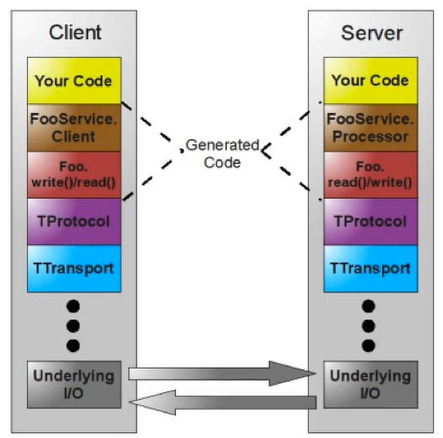
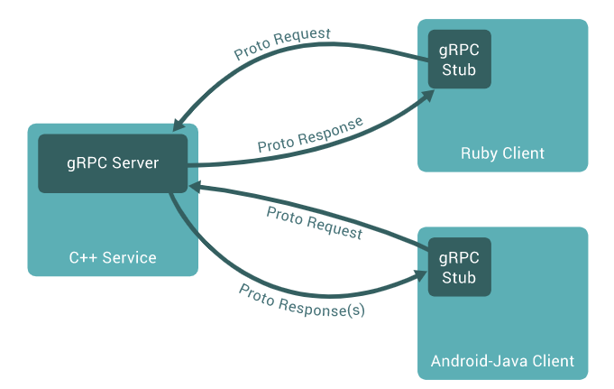

## netty作用方向
- 作为http服务器，类似tomcat,处理请求。但并没有实现servlet规范。
- socket开发。客户端与服务器端通过socket进行调用，比如dubbo和spark等。
- 支持长连接开发。

## websocket
- 是一种规范，属于html5规范的一部分，解决http协议存在的一些问题
- http是无状态的(即两次请求之间没有关系)。cookie、session就是为了解决这个问题
- http是基于请求和响应模式的。1.0不支持长连接，1.1通过keepAlive让客户端和服务端在一定时间内保持连接
- http 1.0 1.1都不支持服务器向客户端推送数据。 
- websocket可以实现服务端与客户端之间的长连接，真正意义上的长连接，如果没有其他因素干扰，连接不会断掉。
- websocket连接建立后双方是对等的，服务端可以随意向客户端发送数据，客户端也可以向服务端发送数据，双方只需要发送数据本身，而不需要发送头信息
- websocket是基于http协议的
- websocket也可以用在非浏览器的应用上，比如安卓、IOS

## rmi
- remote method invocation，只针对java，跨机器的方法调用
- client调用server的特定方法，调用对象、调用方法、参数等序列化后传输给server，server进行反序列化，执行调用
- 调用结果序列化后再返回给client，client再反序列化成真正的结果
- 序列化、反序列化也叫编码、解码

## RPC
- remote procedure call，很多RPC框架是跨语言的(服务端、客户端可以是不同的语言)
- 模式：
    1. 定义一个接口说明文件：描述了对象、对象成员、接口方法的一系列信息
    2. 通过RPC框架所提供的编译器，将接口说明文件编译成具体语言文件
    3. 在客户端与服务器端分别引入RPC编译器所生成的文件，即可像调用本地方法一样调用远程方法
- webservice VS RPC
    - RPC框架性能被编解码的效率所影响，比如100个字节的文件，编码压缩后只有10字节，传输就会较快。WebService传输的量比较大，效率就较低。
    - RPC通过socket来传输，webservice通过http来传输，socket效率更高
    
## Protocol Buffers
- 是一种语言中立，平台中立，可扩展的用于序列化、结构化数据的机制
[官网](https://developers.google.com/protocol-buffers)
[文档](https://developers.google.com/protocol-buffers/docs/javatutorial)
[下载地址](https://github.com/protocolbuffers/protobuf/releases)    
- 下载后配置环境变量，即可使用protoc命令，使用protoc运行.proto文件即可生成源代码文件
- 对于同一个proto文件中可能会定义多个message，在传输时具体传输的message需要按需求变化，解决方案可以参考MyDataInfo.proto中定义的MyMessage，
MyMessage中指定data_type，在传输时指定类型为MyMessage，实际传输的message根据MyMessage的data_type获取。示例可见cn.andios.netty.sixth
- 对于MyDataInfo.proto生成的java文件，服务端和客户端都需要调用，如何让它们都可以调用?(假设项目基于git管理)
1. 利用`git submodule`(git外仓库的一个里层仓库)，假设把MyDataInfo.proto生成的java文件放到`ProtoBuf-Java`项目中，让服务端和客户端都引用这个项目。
- 缺点：
    1. 项目分支一般分为：develop、test、master，服务端、客户端、ProtoBuf-Java可能都有多个分支。服务端、客户端、ProtoBuf-Java等项目的分支都要一一对应，即
    服务端develop分支对应ProtoBuf-Java项目develop分支，不能对应ProtoBuf-Java项目master分支。而在分支切换时，由于疏忽往往切换外层项目分支，没有切换里层项目分支
    2. 比如客户端引入了ProtoBuf-Java项目，客户端中修改了ProtoBuf-Java项目文件，把结果推送到ProtoBuf-Java项目远程，此时git submodule也可能会产生一些问题
2. 利用`git subtree`，将ProtoBuf-Java项目拉取到客户端或者服务端中，与`git submodule`不同的是，此时它们属于同一个项目，而不是两个仓库。此时就不存在外层仓库
与里层仓库分支不一样的情况。
3. 每次修改都把ProtoBuf-Java项目打成jar包放到私服里，方法可行，但每次修改都要改变版本号，修改pom.xml等文件，比较麻烦
    
## Apache Thrift
- [下载](https://mirror.bit.edu.cn/apache/thrift/)
- 可伸缩的跨语言的服务开发，融合一个软件栈和代码生成引擎构建高效的服务。
- Thrift是一个典型的CS结构，客户端和服务端可以使用不同的语言开发。既然客户端和服务端能使用不同的语言开发，就一定要有一种中间语言来关联客户端和服务端的语言。它
就是IDL(Interface Description Language)
- 实现多语言之间的通信
    - 数据传输使用socket(多种语言均支持)，数据再以特定的个数(string等)发送，接收方语言进行解析
- Thrift架构
-     
- Thrift传输格式
    - TBinaryProtocol：二进制格式
    - TCompactProtocol：压缩格式
    - TJSONProtocol：JSOn格式
    - TSimpleJSONProtocol：提供JSON只写协议，生成的文件很容易通过脚本语言解析。这种协议缺少必要的元数据信息，解码时没有参照的标准，可以生成，但对端不能解析
    - TDebugProtocol：使用易懂的可读的文本格式，以便于debug
- Thrift数据传输方式
    - TSocket：阻塞式socket
    - TFramedTransport：以frame为单位进行传输，非阻塞式服务中使用
    - TFileTransport：以文件形式进行传输
    - TMemoryTransport：将内存用于IO，Java实现时内部实际使用了简单的ByteArrayOutStream
    - TZlibTransport：使用zlib进行压缩，与其他传输方式联合使用，当前无java实现
- Thrift支持的服务模型
    - TSimpleServer：简单的单线程服务模型，常用于测试
    - TThreadPoolServer：多线程服务模型，使用标准的阻塞式IO
    - TNonblockingServer：多线程服务模型，使用非阻塞IO(需要使用TFrameTransport数据传输方式)
    - THsHaServer：THsHa引入了线程池去处理，其模型把读写任务放到线程池去处理，Half-sync/Half-async的处理模型，Half-async是在处理IO事件上(accept/read/write io)，
    Half-async使用handler对rpc的同步处理
    
## gRPC
[官网](https://grpc.io/)
- gRPC可以使用Protocol Buffers既作为IDL(Interface Description Language)又作为底层消息交换的格式
- 在gRPC中一个客户端应用可以直接调用在不同机器上的服务端应用的方法，就像一个本地对象一样，这使得可以轻松的创建分布式应用和服务。就像很多RPC系统一样，gRPC基于定义
一个服务，指定好可以远程调用的方法，同时带上参数和返回类型的这种想法。在服务器端，服务器会实现这个接口，运行一个服务器来处理客户端的调用；在客户端，提供与服务器相同的方法
-   
- gRPC客户端和服务端可以在各种各样的环境下运行并相互通信，比如可以使用Go、Python作为客户端，用Java作为服务端
 
### Service definition
- 就像很多gRPC系统一样，就像很多RPC系统一样，gRPC基于定义一个服务，指定好可以远程调用的方法，同时带上参数和返回类型的这种想法。默认情况下gRPC会使用Protocol Buffers作为IDL,
用于描述服务接口以及payload message的结构
    ```proto
        service HelloService {
          rpc SayHello (HelloRequest) returns (HelloResponse);
        }
        
        message HelloRequest {
          string greeting = 1;
        }
        
        message HelloResponse {
          string reply = 1;
        }
    ```
- gRPC可以让我们定义4种服务方法
    - 一元RPC，客户端向服务端发送单个请求并获得单个响应，就像普通方法调用一样
    ```
        rpc SayHello(HelloRequest) returns (HelloResponse);
    ```
    - 服务器流式RPC，客户端向服务端发送请求，并获取流以读取会一系列消息，客户端从返回的流中读取，直到没有更多消息为止。gRPC保证单个RPC调用中的消息顺序
    ```
        rpc LotsOfReplies(HelloRequest) returns (stream HelloResponse);
    ```
    - 客户端流式RPC，客户端编写消息序列，然后再次使用提供的流将它们发送到服务器。客户端写完消息后，它将等待服务器读取消息并返回响应。gRPC保证单个RPC调用中的消息顺序。
    ```
        rpc LotsOfGreetings(stream HelloRequest) returns (HelloResponse);
    ```
    - 双向流式RPC，双方都使用读写流发送一系列消息。这两个流独立运行，因此客户端和服务器可以按照自己喜欢的顺序进行读写：例如，服务器可以在写响应之前等待
    接受所有客户端消息，或者可以先读取消息在写入消息，或者其他一些读写组合。每个流中的消息顺序都会保留
    ```
        rpc BidiHello(stream HelloRequest) returns (stream HelloResponse);
    ```
### Using the API surface
- 从一个.proto文件服务定义开始，gRPC提供protocol buffer编译器插件自动生成服务器端和客户端代码文件，gRPC用户通常会在客户端调用这些API，在服务器端实现相应的API.
22~31

